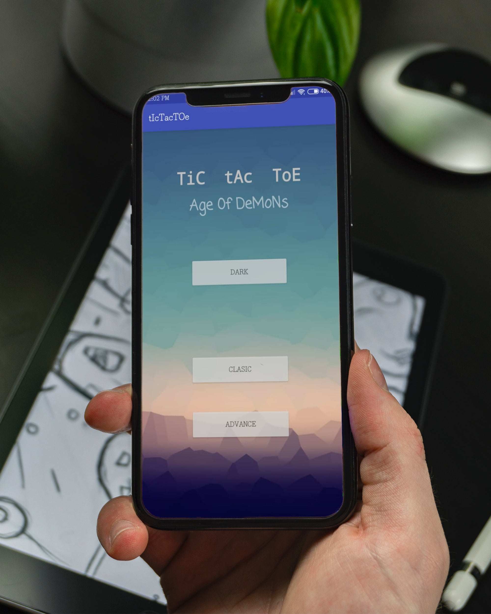

# Tic Tac Toe
#### Android Game

## Introduction:
* Tic Tac Toe is an android game it has 3 different Modes.
* Classic mode with 3X3 board.
* Advance Mode with 4X4 board.
* Dark Mode

* This is complete and released version of application.
*Aplication is quite handy and easy to use with minimilistic UI.

## Prerequisites:
You must have Android Studio install and configured properly.
You must know basic of java Sytax ,OOP concepts for android building and litle bit of XML.

## Technology Stack:
* Java
* XML

## Tools :
* Android studio
* Android Virtual Device 

## Getting Started:
* clone repo
* Open Project in Android Studio
* sync, build the gradle

* if wanted to check the android application can follow  <a href='./app/release/app-release.apk'>This Path</a>a>  and download apk file .

## Built With:
* Android Studio
* Android virtual Device.

## Author
* Vishal Mane

